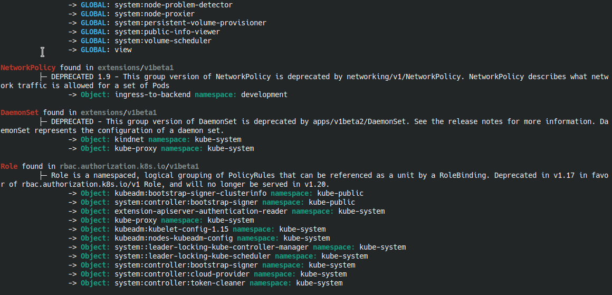

# Deprecations  AKA KubePug - Pre UpGrade (Checker)
[](https://deepsource.io/gh/rikatz/kubepug/?ref=repository-badge)
[](https://codebeat.co/projects/github-com-rikatz-kubepug-master)


KubePug/Deprecations is intended to be a kubectl plugin, which:

* Downloads a swagger.json from a specific Kubernetes version
* Parses this Json finding deprecation notices
* Verifies the current kubernetes cluster or input files checking whether exists objects in this deprecated API Versions, allowing the user to check before migrating

## How to use it as a krew plugin

Just run `kubectl krew install deprecations`

## How to use it with Helm

If you want to verify the generated manifests by Helm, you can run the program as following:

```console
helm template -f values.yaml .0 | kubepug --k8s-version v1.22.0 --input-file=-
```

Change the arguments in kubepug program (and Helm template!) as desired!

## How to Use it as a standalone program

Download the correct version from [Releases](https://github.com/rikatz/kubepug/releases/latest) page.

After that, the command can be used just as kubectl, but with the following flags:

```console
$ kubepug --help
[...]
Flags:
      --api-walk                 Whether to walk in the whole API, checking if all objects type still exists in the current swagger.json. May be IO intensive to APIServer. Defaults to true (default true)
      --cluster string           The name of the kubeconfig cluster to use
      --context string           The name of the kubeconfig context to use
      --description              DEPRECATED FLAG - Whether to show the description of the deprecated object. The description may contain the solution for the deprecation. Defaults to true (default true)
      --error-on-deleted         If a deleted object is found, the program will exit with return code 1 instead of 0. Defaults to false
      --error-on-deprecated      If a deprecated object is found, the program will exit with return code 1 instead of 0. Defaults to false
      --filename string          Name of the file the results will be saved to, if empty it will display to stdout
      --force-download           Whether to force the download of a new swagger.json file even if one exists. Defaults to false
      --format string            Format in which the list will be displayed [stdout, plain, json, yaml] (default "stdout")
  -h, --help                     help for kubepug
      --input-file string        Location of a file or directory containing k8s manifests to be analized
      --k8s-version string       Which kubernetes release version (https://github.com/kubernetes/kubernetes/releases) should be used to validate objects. Defaults to master (default "master")
      --kubeconfig string        Path to the kubeconfig file to use for CLI requests.
      --swagger-dir string       Where to keep swagger.json downloaded file. If not provided will use the system temporary directory
      --tls-server-name string   Server name to use for server certificate validation. If it is not provided, the hostname used to contact the server is used
  -v, --verbosity string         Log level: debug, info, warn, error, fatal, panic (default "warning")
      --version                  version for kubepug
```

### Checking a Kubernetes Cluster

You can check the status of a running cluster with the following command.

```console
$ kubepug --k8s-version=v1.18.6 # Will verify the current context against v1.18.6 swagger.json
[...]
RESULTS:
Deprecated APIs:

Ingress found in extensions/v1beta1
         ├─ Ingress is a collection of rules that allow inbound connections to reach the endpoints defined by a backend. An Ingress can be configured to give services externally-reachable urls, load balance traffic, terminate SSL, offer name based virtual hosting etc. DEPRECATED - This group version of Ingress is deprecated by networking.k8s.io/v1beta1 Ingress. See the release notes for more information.
                -> OBJECT: nginxnok namespace: default
                -> OBJECT: nginxok namespace: default


Deleted APIs:

DaemonSet found in extensions/v1beta1
         ├─ API REMOVED FROM THE CURRENT VERSION AND SHOULD BE MIGRATED IMMEDIATELY!!
                -> OBJECT: kindnet namespace: kube-system
                -> OBJECT: kube-proxy namespace: kube-system

Deployment found in extensions/v1beta1
         ├─ API REMOVED FROM THE CURRENT VERSION AND SHOULD BE MIGRATED IMMEDIATELY!!
                -> OBJECT: coredns namespace: kube-system
                -> OBJECT: local-path-provisioner namespace: local-path-storage

ReplicaSet found in extensions/v1beta1
         ├─ API REMOVED FROM THE CURRENT VERSION AND SHOULD BE MIGRATED IMMEDIATELY!!
                -> OBJECT: coredns-6dcc67dcbc namespace: kube-system
                -> OBJECT: local-path-provisioner-56fcf95c58 namespace: local-path-storage

```

### Putting Kubepug in your CI / Checking input files

You can verify files with the following:

```console
$ kubepug --input-file=./deployment/ --error-on-deleted --error-on-deprecated
```

With the command above
* The swagger.json from master branch will be used
* All YAML files (excluding subdirectories) will be verified
* The program will exit with an error if deprecated or deleted objects are found.


### Air-gapped environment

This happens when you have a secure environment that does not have an internet connectivity.

Steps to follow:

1. Download swagger file in a machine that has internet connection

```console
$ curl -o swagger-v1.17.0.json https://raw.githubusercontent.com/kubernetes/kubernetes/v1.17.0/api/openapi-spec/swagger.json
```

2. Securely move the json file to your Air-Gapped environment, to the folder of your choosing. This folder will be used by `kubepug`.

3. Execute `kubepug` with the option `swagger-dir`, like this

```console
$ kubepug --k8s-version=v1.17.0 --swagger-dir=/your/swagger/folder
```

This will verify the current context against the swagger file we downloaded and copied over manually

### Example of Usage in CI with Github Actions

```yaml
name: Sample CI Workflow
# This workflow is triggered on pushes to the repository.
on: [push]
env:
  HELM_VERSION: "v3.9.0"
  K8S_TARGET_VERSION: "v1.22.0"

jobs:
 api-deprecations-test:
    runs-on: ubuntu-latest
    steps:
      - name: Check-out repo
        uses: actions/checkout@v2

      - uses: azure/setup-helm@v1
        with:
          version: $HELM_VERSION
        id: install

      - uses: cpanato/kubepug-installer@v1.0.0

      - name: Run Kubepug with your Helm Charts Repository
        run: |
          find charts -mindepth 1 -maxdepth 1 -type d | xargs -t -n1 -I% /bin/bash -c 'helm template % --api-versions ${K8S_TARGET_VERSION} | kubepug --error-on-deprecated --error-on-deleted --k8s-version ${K8S_TARGET_VERSION} --input-file /dev/stdin'
```

## Screenshot



## References

As I've used this project to learn Go and also some Kubernetes [client-go](https://github.com/kubernetes/client-go/) some parts of this plugin are based in Caio Begotti's [Pod-Tree](https://github.com/caiobegotti/Pod-Dive), Ahmet Balkan [kubectl-tree](https://github.com/ahmetb/kubectl-tree) and Bitnami [Kubecfg](https://github.com/bitnami/kubecfg)

Logo based in <a href="https://br.freepik.com/fotos-vetores-gratis/mao">Mão vetor criado por freepik - br.freepik.com</a>
